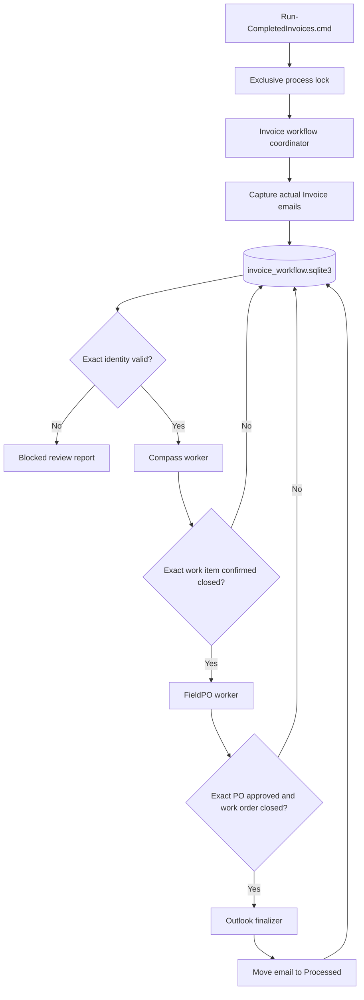

# Completed Invoices Workflow Redesign Plan

## Objective

Rename the bootstrap to `Run-CompletedInvoices.cmd` and use it as the only executable workflow entry point. One coordinator will compose importable Outlook, identity, Compass, FieldPO, persistence, and finalization modules. There will be no alternate production CLIs, fallback queues, heuristic matchers, or compatibility execution paths.

An invoice moves to Outlook `Processed` only after all three required outcomes are confirmed:

1. The associated Compass Glass work item is closed.
2. The exact FieldPO PO is approved.
3. The associated FieldPO work order is closed.

## State Contract

- One business record exists per source Outlook message, keyed and retrieved only by exact `InternetMessageID`. `EntryID` may be logged diagnostically but is never an alternate locator.
- Persist invoice number, subject and PDF PO numbers, VIN, MVA, invoice amount, FieldPO authorized amount, and received timestamp.
- Every repeated invoice number blocks all messages with that number. The workflow never chooses, links, or deduplicates repeated invoice messages automatically.
- Independently track identity, Compass, PO, FieldPO work-order, and Outlook states as `pending`, `in_progress`, terminal success, `blocked`, or `failed`.
- Record every attempt before external work and complete it afterward. A stale `in_progress` stage is reconciled through the same worker's exact live read-before-act check.
- Success requires an action performed now or exact live read-back through the same worker. Absence or generic not-found is not proof of completion.
- `Processed` is the sole completion signal. Green Category is ignored and never read or written by the new workflow.
- Existing messages already in `Processed` are trusted complete and excluded from migration.
- `Receipt for Job` messages are excluded.

## Execution Foundations

1. Define immutable typed command/result dataclasses and `Protocol` interfaces for Outlook, Sheet identity, Compass, FieldPO, repository, and logging dependencies.
2. Keep the coordinator synchronous and phases sequential. Execute the complete asynchronous Compass batch once with `asyncio.run()`, close it, then execute the synchronous FieldPO batch. Do not nest event loops, run workers concurrently, share browser contexts, or convert either worker only for uniformity.
3. Hold an exclusive Windows process lock for the complete run. A second invocation exits with code `1` before Outlook, browser, or SQLite access.
4. For every mutation: read exact external state, act only when incomplete, read back exact success, then commit a short ledger transaction. External actions are not rollback-capable.
5. Compass and FieldPO use separate existing browser profiles and contexts. Each worker owns one context for its complete batch and closes it in `finally`.
6. Create one Outlook COM namespace per run on the main STA thread after `pythoncom.CoInitialize()`. Release references and call `CoUninitialize()` in `finally`.
7. Build one in-memory map from exact `InternetMessageID` to parent-folder message. Missing or duplicate IDs block. Finalization moves and verifies the same mapped message without another locator.

## Worker Modules

### Compass

Extract one Compass module from `WorkItems/close_workitem.py`. It accepts exact invoice key, nine-digit MVA, and `Glass` complaint type, then returns structured results. It must distinguish closed, already-closed-confirmed, not-found, navigation failure, timeout, and error. Not-found is blocked, not handled.

### FieldPO

Extract one FieldPO module from `outlook/agn_invoices.py`. It accepts exact invoice key, PO, VIN, MVA, and invoice amount. It revalidates exact identity, approves the PO, closes the work order, reads back both final states, and returns structured results.

### Outlook

Add one Outlook source/finalizer module. It scans only actual `Invoice #` messages in the parent folder, parses each PDF once, uses exact `InternetMessageID`, and moves only when directed by the coordinator. Receipts and categories are not inspected.

No worker exposes an invoice execution CLI. Diagnostics, retries, and production actions all enter through `Run-CompletedInvoices.cmd`.

## Identity Validation

`identity.py` receives one parsed immutable invoice plus injected read-only Sheet and FieldPO identity ports. One strict route applies:

1. Subject PO and PDF PO must both exist and agree.
2. The PO must match the exact FieldPO PO.
3. Invoice VIN must match FieldPO VIN.
4. The Sheet must resolve that VIN to exactly one valid MVA.
5. FieldPO MVA must equal the Sheet MVA.
6. Invoice and authorized amounts must satisfy the configured exact policy.

Missing, conflicting, or ambiguous values block before any mutation. The workflow never chooses a newest or oldest Sheet row when MVAs conflict.

## SQLite Repository

`invoice_workflow/store.py` is the sole DAO. SQL does not appear in the coordinator or workers.

Every connection enables:

- `PRAGMA foreign_keys=ON`
- `PRAGMA journal_mode=WAL`
- `PRAGMA synchronous=FULL`
- A bounded `busy_timeout`

Use context-managed, parameterized, short transactions around one logical checkpoint. Never hold a transaction while calling Outlook, Sheets, Compass, or FieldPO. Use schema `CHECK` constraints, unique exact message IDs, indexed invoice/status lookups, append-only attempts, and transactional numbered migrations through `PRAGMA user_version`.

Store runtime artifacts at:

- `data/invoice_workflow.sqlite3`
- `data/invoice_workflow.sqlite3-wal`
- `data/invoice_workflow.sqlite3-shm`
- `data/invoice_workflow.lock`

All are gitignored.

## Coordinator

`invoice_workflow/coordinator.py` is the sole production coordinator:

1. Acquire process lock.
2. Initialize logging, repository, and Outlook COM.
3. Capture and upsert invoices.
4. Block every repeated invoice number transactionally.
5. Resolve exact identities.
6. Execute eligible Compass work and checkpoint results.
7. Execute eligible FieldPO work and checkpoint results.
8. Move only fully successful invoices to `Processed` and verify the move.
9. Release COM, browsers, database connections, logging handlers, and lock in deterministic `finally` blocks.

A blocked or failed invoice stops at its exact stage while unrelated validated invoices continue. Exit codes:

- `0`: all eligible work completed.
- `1`: run-level infrastructure failure prevented reliable continuation.
- `2`: one or more invoices remain blocked or failed.

Supported coordinator options:

- `--max-invoices N`
- `--invoice-number N`
- `--resume-failed`

## Logging and Review

Create one UTF-8 log per invocation under `log/completed_invoices/`, named with UTC timestamp and run ID. Every line includes timestamp, level, run ID, invoice number when known, stage, and event.

Log capture counts, exact identity values, validation results, action starts/results/durations, read-back confirmation, Outlook move, resumed-stage skips, and full exception traces. Redact credentials, tokens, cookies, email bodies, and PDF contents.

Browser-stage failures save screenshots under `log/completed_invoices/failures/<run_id>/`. Screenshot failure is logged and never replaces the original failure.

Generate `outlook/invoice_review.csv` from blocked ledger records. It is reporting only and cannot authorize or control execution.

At startup, delete completed-invoice logs and failure screenshots older than 15 days by UTC modification time. Cleanup is restricted to `log/completed_invoices/`, logs every deletion/error, and does not alter workflow execution.

## Selector Policy

- No heuristic matching or selector, session, navigation, or workflow fallback is permitted initially.
- A consistently failing selector is an implementation defect. Inspect the live DOM/accessibility tree, correct the owning action object and focused tests, then rerun the same path.
- A fallback may be proposed only after logs and screenshots prove genuine repeatable UI variants for the same business state.
- Any future fallback requires explicit approval, a documented discriminator that selects exactly one variant before interaction, and dedicated tests for every observed variant.
- Timeouts, stale sessions, weak selectors, or transient failures are not evidence for a fallback.

## Regression-Safe Rollout and Failback

1. Build and test the new package alongside untouched production scripts. Shadow validation may read production systems but may not mutate them or mark mutation stages successful.
2. Before cutover, stop invoice launchers, verify no process lock exists, tag the last verified legacy release, and back up configuration, legacy state artifacts, and the new database if present.
3. Record code revision, schema version, backup paths, and cutover time in `log/completed_invoices/releases/`.
4. Cut over atomically, remove the old bootstrap name, and run one exact known invoice as the production canary.
5. If the canary fails before any external mutation starts, manually restore the verified legacy release.
6. If an external mutation started or may have succeeded, legacy failback is prohibited. Preserve ledger/logs, stop additional invoices, and correct/resume the new path from exact live state.
7. Later releases may roll back only to the immediately previous schema-compatible, ledger-aware coordinator without restoring an older database.
8. `Restore-CompletedInvoicesRelease.ps1` is a deployment-only manual utility. It requires a release manifest and confirmation, refuses unsafe rollback, and cannot execute invoice work.
9. Keep the active and immediately previous verified release plus cutover backups for at least 15 days.

Deployment failback is manual release rollback only. Runtime never switches implementations automatically.

## Implementation Phases

### Phase 1: Foundation

- Create typed contracts and dependency protocols.
- Implement process locking and resource lifecycle.
- Implement the SQLite repository and schema migrations.
- Implement run logging, redaction, retention, and review output.

### Phase 2: Stable Workers

- Extract Compass worker with exact closed-state read-back.
- Extract FieldPO worker with exact PO/work-order read-back.
- Extract Outlook capture and finalization with exact message identity.
- Implement strict identity resolution.

### Phase 3: Coordinator and Bootstrap

- Implement coordinator state transitions and crash recovery.
- Rename bootstrap to `Run-CompletedInvoices.cmd` without an alias.
- Remove mandatory `outlook/po_numbers.txt` input.
- Remove invoice coordination from `Run-BuildCloseQueue.cmd`.

### Phase 4: Migration and Cutover

- Import actual parent-folder invoices through the production Outlook path.
- Do not import CSV, queue, or category state as workflow evidence.
- Validate one production canary, interrupted resume, then a capped backlog.
- Remove legacy invoice-state ownership only after migration is verified.

## Verification

1. Test all legal and illegal state transitions, rollback, duplicate blocking, exact message-map failures, stale `in_progress` reconciliation, and same-path resume.
2. Test WAL, foreign keys, synchronous mode, busy timeout, parameterized DAO operations, schema migration rollback, and process lock contention.
3. Test every strict identity gate before mutation.
4. Simulate a crash between every external success and ledger commit. On rerun, prove the same worker's live precheck prevents repeated mutation.
5. Test worker failures, Outlook move failure, and a second coordinator invocation.
6. Test log context, exception traces, redaction, screenshot naming, summary parity, and cleanup boundaries.
7. Run the existing AGN invoice and Compass closure suites.
8. Run `Run-CompletedInvoices.cmd --max-invoices 1` and inspect its complete log.
9. Run one exact production invoice and verify all read-backs, ledger attempts, log evidence, and final Outlook move.
10. Interrupt after Compass success, rerun, and prove Compass is not mutated again.
11. Process a capped backlog and reconcile ledger totals against Outlook.
12. Rehearse safe pre-mutation legacy failback, prohibited post-mutation legacy failback, and later rollback to a compatible ledger-aware release.

## Approved Decisions

- One executable entry point: `Run-CompletedInvoices.cmd`.
- Dry-run was a development-only validation tool and is not a final runtime feature. See `Docs/CompletedInvoicesDryRunDecision.md`.
- Compass first, FieldPO second, Outlook finalization last.
- Required completion: Compass work item closed, FieldPO PO approved, and FieldPO work order closed.
- Production is automatic only after strict identity validation.
- Unrelated invoices continue after an invoice-scoped failure; unresolved items produce exit code `2`.
- Coordinator execution is sequential with separate browser contexts and no worker concurrency.
- One exclusive process lock prevents simultaneous runs.
- External side effects are never described as rollback-capable.
- Existing `Processed` messages are trusted complete.
- Google Sheet updates are not a completion gate.
- Logs, screenshots, and release artifacts have 15-day retention.
- Receipts and unrelated GlassOrchestrator phases are outside scope.
